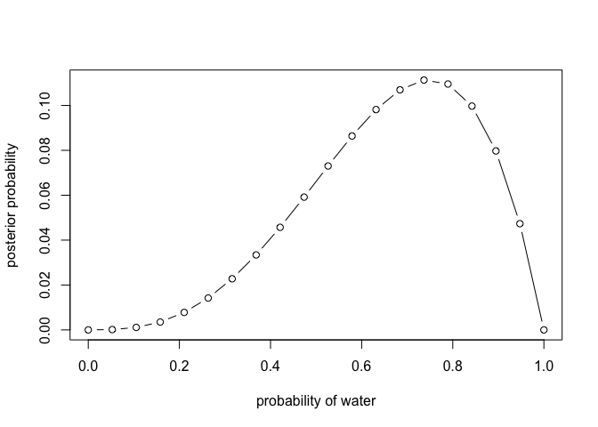
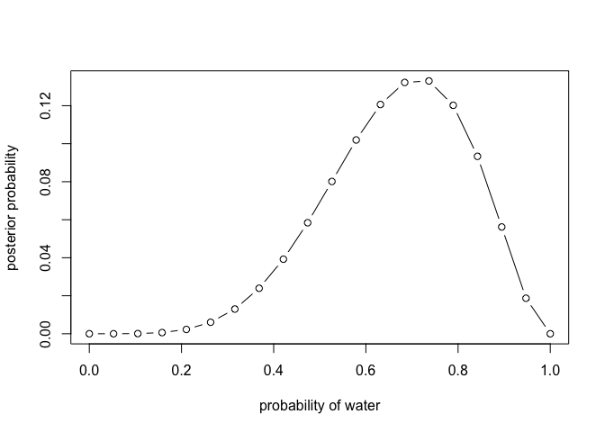
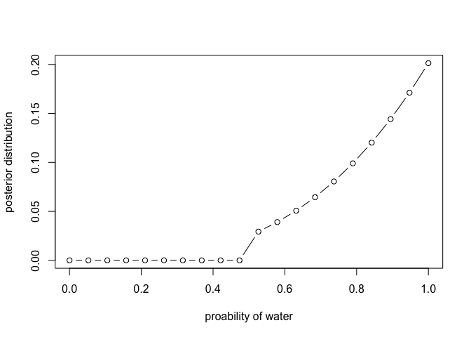
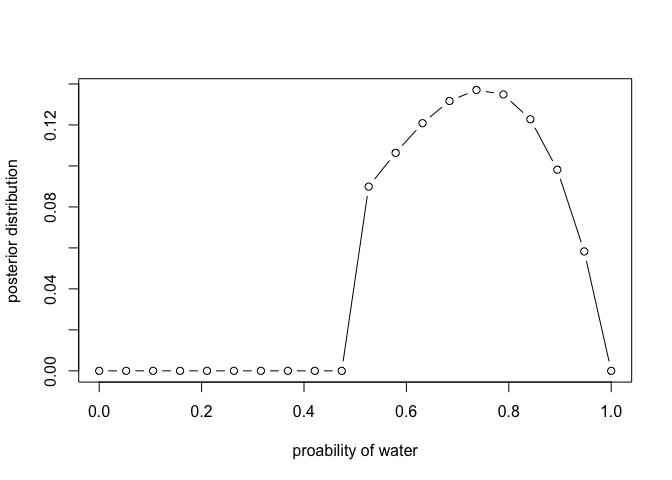
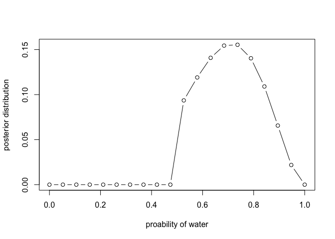

# RethinkingStatistics.Ch2
Rongkui Han  
July 7, 2017  
2E1:  
(2)  
  
2E2:  
(3)  

2E3:  
(1). This is the same as last questions.  

2E4:  
"the probability of water is 0.7": literally it means from the data we observed, the chance of getting water when we toss a globe is 0.7. Does it mean that our best estimate for the perentage of global surface covered with water is 70%?  

2M1(1):  

```r
p_grid = seq(from = 0, to = 1, length.out = 20)
prior = rep(1,20)
likelihood = dbinom(3, size = 3, prob = p_grid)
unstd.posterior = likelihood*prior
posterior = unstd.posterior/sum(unstd.posterior)
plot(p_grid, posterior, type = "b", xlab = "probability of water", ylab = "posterior probability")
```

<!-- -->

2M1(2):  

```r
#p_grid = seq(from = 0, to = 1, length.out = 20)
#prior = rep(1,20)
likelihood2 = dbinom(3, size = 4, prob = p_grid)
unstd.posterior2 = likelihood2*prior
posterior2 = unstd.posterior2/sum(unstd.posterior2)
plot(p_grid, posterior2, xlab = "probability of water", ylab = "posterior probability", type = "b")
```

<!-- -->

2M1(3):  

```r
likelihood3 = dbinom(5, size = 7, prob =  p_grid)
unstd.posterior3 = likelihood3*prior
posterior3 = unstd.posterior3/sum(unstd.posterior3)
plot(p_grid, posterior3, xlab = "probability of water", ylab = "posterior probability", type = "b")
```

<!-- -->

2M2:  

```r
prior2 = c(rep(0,10), rep(2, 10))
unstd.posterior1.2 = likelihood*prior2
posterior1.2 = unstd.posterior1.2/sum(unstd.posterior1.2)
plot(p_grid, posterior1.2, xlab = "proability of water", ylab = "posterior distribution", type = "b")
```

<!-- -->

```r
unstd.posterior2.2 = likelihood2*prior2
posterior2.2 = unstd.posterior2.2/sum(unstd.posterior2.2)
plot(p_grid, posterior2.2, xlab = "proability of water", ylab = "posterior distribution", type = "b")
```

<!-- -->

```r
unstd.posterior3.2 = likelihood3*prior2
posterior3.2 = unstd.posterior3.2/sum(unstd.posterior3.2)
plot(p_grid, posterior3.2, xlab = "proability of water", ylab = "posterior distribution", type = "b")
```

<!-- -->

2M3:   
P(E|L) = P(L|E) x P(E) / P(L)    
P(E|L) = 0.3 x 0.5 / [P(L|E) x P(E) + P(L|M) x P(M)]  
P(E|L) = 0.15 / (0.15 + 1 x 0.5)  
P(E|L) = 0.23  

2M4:  
Possible card:       Ways of producing outcome:  
white/white          0  
white/black          1  
black/black          2  

```r
ways  = c(0,1,2)
ways/sum(ways)
```

```
## [1] 0.0000000 0.3333333 0.6666667
```

Therefore the probability that the other side is also black is 2/3. This is rather counterintuitive but somehow it makesnese... the moment you pull up a black card, the probability of it being the double-black card is already higher than it being the single-black card.    

2M5:  
Possible card:       Ways of producing outcome:  
white/white          0  
white/black          1  
black/black-1        2
black/black-2        2

```r
ways2 = c(0,1,2,2)
ways2/sum(ways2)
```

```
## [1] 0.0 0.2 0.4 0.4
```

Therefore the probability that thie other side is also black is 0.4 + 0.4 = 0.8.  

2M6:  
Possible card:       Ways of producing outcome:  
white/white          0  
white/black          2  
black/black          2  

```r
ways3 = c(0,2,2)
ways3/sum(ways3)
```

```
## [1] 0.0 0.5 0.5
```

Now the probability that the other side is also black is 0.5.  

2M7:  
Possible 1st card:    Possible 2nd card:    Ways of producing outcome:  
white/white           white/black           0  
white/white           black/black           0
white/black           white/white           1*2
white/black           black/black           1*0
black/black           white/white           2*2
black/black           white/black           2*1

```r
ways4 = c(0,0,2,0,4,2)
ways4/sum(ways4)
```

```
## [1] 0.00 0.00 0.25 0.00 0.50 0.25
```

Therefore the probability that the first card was double black is 0.5 + 0.25 = 0.75.  

2H1:  
We call the 10% twin rate species A, the 20% twin rate species B.  
P(A|Twin) = P(Twin|A) x P(A)/[P(Twin|A) x P(A) + P(Twin|B) x P(B)]  
P(A|Twin) = 0.1 x 0.5 / (0.1 x 0.5 + 0.2 x 0.5)  
P(A|Twin) = 0.33  
Therefore. P(B|Twin) = 0.67  
Therefore, P(Twin_2) = 0.33 x 0.1 + 0.67 x 0.2 =  0.167  

2H2:  
0.33  

2H3:  
P(A|T-S) = P(T-S|A) x P(A) / [P(T-S|A) x P(A) + P(T-S|B) x P(B)]  
P(A|T-S) = 0.1 x 0.9 x 0.5 / (0.1 x 0.9 x 0.5 + 0.2 x 0.8 x 0.5)  
P(A|T-S) = 0.36  

2H4:  
w/o birth data:  
P(A|possA) = P(PossA|A) x P(A) / [P(PossA|B) x P(B) + P(PossA|A) x P(A)]  
P(A|PossA) = 0.8 x 0.5/(0.35 x 0.5 + 0.8 x 0.5)  
P(A|PossA) = 0.6956522  

w/ birth data:
P(A|PossA, T-S) = P(PossA, T-A|A) x P(A) / [P(PossA, T-S|B) x P(B) + P(PossA, T-S|A) x P(A)]  
P(A|PossA, T-S) = 0.8 x 0.1 x 0.9 x 0.5/(0.8 x 0.1 x 0.9 x 0.5 + 0.35 x 0.2 x 0.8 x 0.5)
P(A|PossA, T-S) = 0.5625

